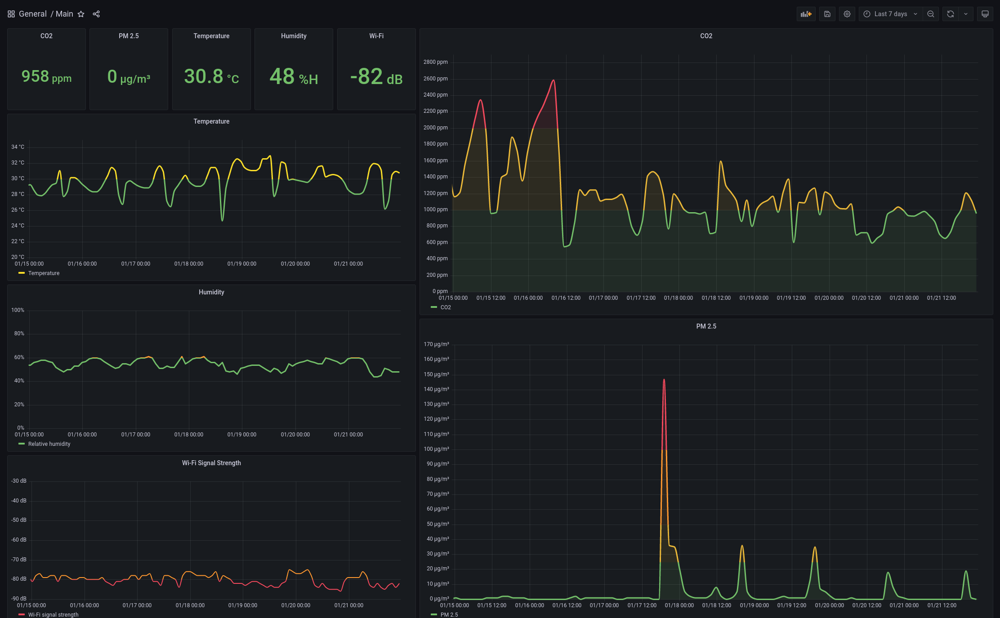

# daq - DIY Air Quality

DIY Air Quality Monitor by [AirGradient](https://www.airgradient.com/diy/) integrated with [AWS Iot Core](https://aws.amazon.com/iot-core/) & [Amazon Timestream](https://aws.amazon.com/timestream/), for display in [Grafana](https://grafana.com/oss/grafana/).

Records & visualises CO2, PM2.5, temperature, and humidity.




**Sections:**

1. [Estimated cost](#estimated-cost)
2. [Assembly](#assembly)
3. [Uploading the custom client](#uploading-the-custom-client)
4. [AWS setup](#aws-setup)
5. [Connect client to AWS](#connect-client-to-aws)
6. [Grafana setup](#grafana-setup)

## Estimated cost

*As of January 2022*

The [DIY kit](https://www.airgradient.com/diy/) can be bought from [AirGradient's shop](https://www.airgradient.com/diyshop/) for between US$46 and US$60 + shipping

AWS IoT Core + Amazon Timestream costs are _estimated_ to be approximately the following:


| Service           | Link                                                              | First month | With 10 years of data |
|-------------------|-------------------------------------------------------------------|-------------|-----------------------|
| AWS IoT Core      | [Pricing](https://aws.amazon.com/iot-core/pricing/)               | US$0.08     | US$0.08               |
| Amazon Timestream | [Pricing](https://aws.amazon.com/timestream/pricing/?nc=sn&loc=3) | US$0.22     | US$0.42               |

Notes:

- Costs will vary depending on usage and prices are subject to change
- You may benefit from using [scheduled queries](https://docs.aws.amazon.com/timestream/latest/developerguide/scheduledqueries.html) depending on your usage patterns
- Assumes running in `us-east-2`
- Assumes limited querying scope and frequency
- Assumes sending data using [Basic Ingest](https://docs.aws.amazon.com/iot/latest/developerguide/iot-basic-ingest.html)
- Assumes 24h in-memory retention

## Assembly

### Hardware:
- WEMOS D1 mini (ESP8266)
- WEMOS D1 mini display (OLED 0.66 Shield)
- Plantower PMS5003
- Sensair S8
- SHT31

Follow the instructions on [https://www.airgradient.com/diy/](https://www.airgradient.com/diy/).

See also Jeff Geerling's video for tips:

[](https://youtu.be/Cmr5VNALRAg?t=173)

## Uploading the custom client

[AirGradient's client](https://www.airgradient.com/diy/#flashing-of-the-d1-mini-with-the-airgradient-firmware) can be uploaded using the Arduino IDE.

This custom client uses the [platformio framework](https://docs.platformio.org/) to manage the toolchain for building and deployment.

### Build

```
pio run
```

### Upload

```
pio run -t upload
```

The OLED screen should begin displaying information.

### Listen to client serial output

```
pio device monitor
```

## AWS Setup

Please note that Amazon Timestream is only supported in a few AWS regions. See the [pricing page](https://aws.amazon.com/timestream/pricing/?nc=sn&loc=3) for details.

All the infrastructure can be deployed using AWS CloudFormation and the [AWS CLI](https://docs.aws.amazon.com/cli/latest/userguide/cli-chap-getting-started.html) or [AWS console](https://docs.aws.amazon.com/AWSCloudFormation/latest/UserGuide/cfn-console-create-stack.html).

Configure environment variables:

```
export AWS_REGION=us-east-2 # ap-southeast-2 when :(
export STACK_NAME=daq
```

Create the [client certificates](https://docs.aws.amazon.com/iot/latest/developerguide/device-certs-create.html) to connect to AWS IoT Core:

```
aws iot create-keys-and-certificate \
    --certificate-pem-outfile "daq.cert.pem" \
    --public-key-outfile "daq.public.key" \
    --private-key-outfile "daq.private.key" > cert_details.json
```

Deploy the CloudFormation stack:

```
aws cloudformation deploy \
    --template-file cloudformation.yaml \
    --capabilities CAPABILITY_IAM \
    --stack-name $STACK_NAME \
    --parameter-overrides MemoryRetentionHours=24 MagneticRetentionDays=3650 # Adjust to your preference
```

```
aws cloudformation describe-stacks --stack-name $STACK_NAME > stack_details.json
```

Once the stack has been successfully deployed, configure the certificate.

```
cat cert_details.json stack_details.json
```

Mark as active:

```
aws iot update-certificate --certificate-id {CERTIFICATE_ID} --new-status ACTIVE
```

Attach Policy:

```
aws iot attach-policy --policy-name {POLICY_NAME} --target {CERTIFICATE_ARN}
```

Attach Thing:

```
aws iot attach-thing-principal --thing-name {THING_NAME} --principal {CERTIFICATE_ARN}
```

## Connect client to AWS

In `client/include/config.h`, update the following:

1. Set `THING_NAME` to the name of the created Thing (eg. `daq-Thing-L5KRHBFJORP4`)
2. Set `ROOM` to the human-readable identifier of the room the client is housed in
3. Set `ENABLE_WIFI` to `true`
4. Set `TIME_ZONE` to your timezone
5. Set `AWS_TOPIC` to the created topic rule name with the included prefix (eg. `$aws/rules/TopicRule_0yKDHTposnt5`)
6. Set `AWS_IOT_ENDPOINT` to your AWS IoT Core endpoint (`aws iot describe-endpoint --endpoint-type iot:Data-ATS`)
7. Set `AWS_CERT_CA` to the value of `AWSRootCA1.pem` [link](https://www.amazontrust.com/repository/AmazonRootCA1.pem)
8. Set `AWS_CERT_DEVICE` to the contents of the created `daq.cert.pem` file
9. Set `AWS_CERT_PRIVATE` to the contents of the created `daq.private.key` file

Then upload the changes:

```
pio run -t upload
```

Connect to the Wi-Fi network beginning with `DAQ-`, configure the network connection, and reset.

See [WiFiManager](https://github.com/tzapu/WiFiManager) for more details.

Once the configuration is complete, confirm that the device is sending data to AWS:

```
$ pio device monitor
*wm:[1] AutoConnect 
*wm:[2] Connecting as wifi client... 
*wm:[2] setSTAConfig static ip not set, skipping 
*wm:[1] connectTimeout not set, ESP waitForConnectResult... 
*wm:[2] Connection result: WL_CONNECTED
*wm:[1] AutoConnect: SUCCESS 
Connecting to server
Connected!
{"device_id":"abb44a","room":"office1","wifi":-71,"pm2":0,"co2":733,"tmp":25.60000038,"hmd":53}
{"device_id":"abb44a","room":"office1","wifi":-72,"pm2":0,"co2":735,"tmp":25.60000038,"hmd":53}
{"device_id":"abb44a","room":"office1","wifi":-72,"pm2":0,"co2":739,"tmp":25.60000038,"hmd":53}
```

```
$ aws timestream-query query --query-string 'SELECT * FROM "{DATABASE_NAME}"."{TABLE_NAME}" order by time desc LIMIT 10'
{
    "Rows": [...],
    "ColumnInfo": [
        {
            "Name": "device_id",
            "Type": {
                "ScalarType": "VARCHAR"
            }
        },
        {
            "Name": "room",
            "Type": {
                "ScalarType": "VARCHAR"
            }
        },
        {
            "Name": "measure_name",
            "Type": {
                "ScalarType": "VARCHAR"
            }
        },
        {
            "Name": "time",
            "Type": {
                "ScalarType": "TIMESTAMP"
            }
        },
        {
            "Name": "measure_value::bigint",
            "Type": {
                "ScalarType": "BIGINT"
            }
        },
        {
            "Name": "measure_value::double",
            "Type": {
                "ScalarType": "DOUBLE"
            }
        }
    ],
    "QueryStatus": {
        "ProgressPercentage": 100.0,
        "CumulativeBytesScanned": 1870735,
        "CumulativeBytesMetered": 10000000
    }
}
```

## Grafana setup

See the installation instructions for [Grafana](https://grafana.com/grafana/) and the [AWS Timestream plugin](https://grafana.com/grafana/plugins/grafana-timestream-datasource/).

Relevant timestream queries look like so:

*Note: Adjust the `bin` ranges according to your own conditions*.

### CO2

```sql
select round(avg(measure_value::bigint),0), bin(time, 5m) as timestamp
from $__database.$__table 
where 'co2' = measure_name and time > ago(24h) and measure_value::bigint > 0
group by bin(time, 5m)
order by timestamp
```

### PM2.5

```sql
select max(measure_value::bigint), bin(time, 10m) as timestamp
from $__database.$__table 
where 'pm2' = measure_name and time > ago(24h)
group by bin(time, 10m)
order by timestamp
```

### Temperature

```sql
select round(avg(measure_value::double),1), bin(time, 5m) as timestamp
from $__database.$__table 
where 'tmp' = measure_name and time > ago(24h)
group by bin(time, 5m)
order by timestamp
```

### Humidity

```sql
select round(avg(measure_value::bigint),1), bin(time, 10m) as timestamp
from $__database.$__table 
where 'hmd' = measure_name and time > ago(24h)
group by bin(time, 10m)
order by timestamp
```

### Wi-Fi

```sql
select round(avg(measure_value::bigint),0), bin(time, 5m) as timestamp
from $__database.$__table 
where 'wifi' = measure_name and time > ago(24h)
group by bin(time, 5m)
order by timestamp
```

## Acknowledgements

Thanks to AirGradient for creating this awesome DIY kit, providing the example code, and the Gerber + STL files.

Thanks to Jeff Geerling for the video and commentary.